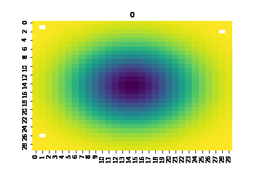

### Estado:

Revisión de capítulo 1 y redacción para revisión de capítulo.

# INSTITUTO TECNOLÓGICO AUTÓNOMO DE MÉXICO

# Algorithms for solving resource allocation and transport networks with low coupled distributed systems (liquid brains)

### 
 TESIS QUE PARA OBTENER EL TÍTULO DE INGENIERO    EN      COMPUTACIÓN 

### 
 P R E S E N T A 

### 
 Jerónimo Aranda Barois 

##### Avisor: Fernando Esponda Darrignton

--------------

## Content

### 1 INTRODUCTION

    1.2 Problem identification
    1.1 Context    
    1.3 Objetives  
    1.4 Scope
    1.5 Design methodology
    1.6 Document organization

### 2 ANALYSIS

    2.1 Functional requirements
    2.3 Design restrictions
    2.4 Related work

### 3 DESIGN SOLUTION

    3.1 Arquitectura
    3.2 Soluciones alternativas
    3.3 Estándares utilizados

### 4 IMPLEMENTATION

    4.1 Descripción completa de la implementación
    4.2 Especificaciones de software y hardware

### 5 RESULTS AND TESTS

    51 Descripción de las pruebas
    5.2 Resultados
    5.3 Análisis de resultados

### 6 CONCLUSIONS

### REFERENCES

-------

## 1. INTRODUCTION

Computing has turned out to be the very essence of things, nature is about information and change, as some of the highest known thinkers, humans should reflect on nature and realize themselves as single neurons in a bigger brain.

### 1.1	Context
When reading a thesis on computer engineering or computer science, one may ask himself what is computing? Computing in most cases seems to be a problem related to sylicon computers, however, from the scope of information theory computing can be generallized to any information processing task. From this point of view we can expand our horizons and expect any kind of information processing to appear in this thesis, for example learning, solving or communicating.
This very general definition allows us to use computing as a perfect framework to try to understand any domain information processing situation, however weird or separate from sylicon computers it may be, this includes economics, social sciences or even biology.
To start it is important to make some definitions, distributed systems in the computational world refer to computing agents that somehow compute and share information, this systems are typically formed by a group of computers and a communication network that connects them, given this definition we can identify neural networks or even human networks as this kind of distributed system, not caring if the computations are biochemical, sylicon or physical based. Citing Michael Levin “It’s not about what you’re made of, it’s about how you compute.” [1]. In the case of neural networks, neurons act as the agents that are able to share  and compute information.

Having introduced this distributed system definition lets introduce some problems that can be solved by them, from a social science perspective this kind of problem solving can be called collective problem solving [2], which cover Crowdsolving, Collective action, Collaborative intelligence, Mass collaboration, Collective wisdom, The Wisdom of Crowds, Distributed knowledge, Online participation, and Group decision-making. These days where we are constantly being attacked by fake news, consensus seems to be really important for any kind of social network, Governments and communities depend on consensus to work well, it determines if the system “trusts” itself and makes the difference for the system to cooperate. Society is able to compute whether a piece of news is actually true or false at some extent. As a society it may be important for us to develop or design a methodology where news or anything can be certified, this may remember some people of blockchains, however this thesis pretends to look at the problem from a different approach, it may also try to solve other relevant problems in the context of low coupled distributed systems (liquid brains), and if possible try to establish the relation between liquid brains and universal Turing machines.

From a biological or ecological point of view, we find ants or bee swarms or whichever biological populations that cooperate. In Economy you may find problems as resource allocation or transport networks. Other interesting problems are calculating maximums between agents, exploring geographic conditions and finding optimums, matching agents (chemical reaction simulations) to enumerate a few.

It is important to bring out the word brain, which I recognize as the word for distributed systems in a biological context, a distinction and introduction between solid brains and liquid brains should be made,  “Some of these networks are describable as static sets of neurons linked in an adaptive web of connections. These are ‘solid’ networks, with a well-defined and physically persistent architecture. Other systems are formed by sets of agents that exchange, store and process information but without persistent connections or move relative to each other in physical space.” [3]
Liquid brains appear in a very long list of systems, “biological systems, such as ant colonies, bacterial colonies, slime moulds and immune systems, process information using agents that communicate locally while moving through physical space.” [4]
Slime moulds have very interesting characteristics, they do not possess a nervous system however some state that they compute! This why they can be considered as the primitive precursors of modern animal brains, even when their computation and communicating networks are based in biochemical signaling. “ Evidence mounts that organisms without nervous systems can in some sense learn and solve problems.” [5]  These statements are also been held for plants.

### 1.2	Problem identification

Among all the interesting problems stated before, we will try to give solutions to 2 of them that are crucial in the economic context, however they may arise in different contexts and its solutions may be biologically inspired, this 2 problems correspond to resource allocation and transporting networks.
A resource allocation problem appears when a valuable and finite resource is found and has to be assigned to a given user, whether this resource is gold, CPU time, water or ant food, and the users people, ants or system users. In this broad context, allocation has to be made eficiently, specially when there are time, cost or space constraints. Because of this a well designed transport network is crucial. The well defined problem statements will be found in the following chapter.

### 1.3	Objectives

The main objective of this thesis is to be able to implement a solution of the previously stated problems with the given design methodology. This means correctly providing a design solution of the previously stated problem, and if possible implement the desing as a product. Moreover, I have another 2 specific objectives, to give some understanding of computing in the information theory context, to build some cross domain networks between biology and economics through computing and mathematics.

To achieve this objectives, it is crucial to be able to correctly define the problem and model its solution with a liquid brain approach. Stating pros and cons of this approach is very important, in the case of the transport network problem we have a benchmark provided by [6]. Results will also require a thorough mathematical analysis.

### 1.4 Scope

The scope of the problems will be well defined in the following chapters, however it is very important to always consider a complexity analysis in order to correctly conclude and scale the solutions. This thesis is not trying to solve every problem but will try to implement a framework where problems can be modeled and hopefully solved by a computing approach without underestimating the complexity of real problems.

### 1.5 Methodology

The design methodology for the solution will be based on Karl T. Ulrich book Design Creation of Artifacts in Society [7], were the design process is considered through an information processing lens, (computing appears again).

This methodology is based in 4 steps. Finding a gap, defining the problem, exploring alternatives and defining a plan.

The gap is found in the narrow definition of computing most of us understand and confuse with its sylicon and digital implementation. We can also find gaps in the cross domain colaborations as in this days science and technology tends to be really speciallized, cross domain bridges are rare, life as an optimization process can give us a lot of inspiration to better design susteinable and robust systems. The problem definition will be well defined in the following chapter. Exploring alternative solutions and its given outcomes will be found in the proof and results chapter.

The chosen plan for this approach will be:

*	Research
*	Provide a design solution
*	Evaluate performance through simulations
*	Conclude
*	Iterate

### 1.6 Document organization

In the introduction you can find the context of the problem and some insights in the methodology that is going to be used, the second chapter will be all about clearly defining the problem and the restrictions involved in the design of the solutions. Chapter 3 will try to state clearly the solutions, which will be then implemented in chapter 4. Chapter 5 will be about the results and tests and chapter 6 will be about the conclusions.

## 2. ANALYSIS

Analysis can be a tricky word for mathematicians, in this section we will try to give a general idea on what we will understand as a design solution, hope it covers the most important sides of the problem.

### 2.1 Functional requirements

A design solution that correctly solves the previously stated problems, resource allocation and transport networks, should be comparable in performance with other domain knowledge  solutions, a solution should clearly state what problem is trying to solve and which performance measures will be used to evaluate its performance.

Resource allocation is generally understood as creating a map between resources and a given population. In this design we will focus in the problem where both the resources and the population are finite. The most general approach will be of having a function f(x) where x is a position and f(x) is the quantity of resource in that position. A solution of the problem is one that assigns every agent a position or a region in the space. One can ask many questions, of each solution, how fast the solution was found, is the solution ‘fair’, to mention some.

The problem of a transport network arises when there exist nodes in a spatial context, a solution is a network that has all of its nodes linked. Of course every solution will have different network properties as the sum of the cost of the links for example.

The solution will be valid if it covers this requirements, to recall them, it clearly states the problem variables, and the design provided covers the performance metrics.

### 2.2	Design and implementation restrictions

As such recurrent problems that appear in a wide range of ambients, from ant colonies to social networks, it has to be clear on the assumptions that are taken so that the conclusions that are made can be valid, this assumptions correspond to the abilities of the agents and the environments where the agents “exist”, as well as the computing ambient where the solutions are simulated, in other words to understand the implications of the parameters mentioned in the preceding section. As the goal is to be able to extrapolate this results to other environments than the ones we simulate.

For the computing implementation restrictions the models will be run in a MacBook Air (13-inch, 2017), processor 1.8 GHz Intel Core i5, memory 8 GB 1600 MHz DDR3 and graphics Intel HD Graphics 6000 1536 MB. Simulations will be done in python and netlogo. Not being able to run every simulation can be an implementation restriction as some solutions may exceed a single computer capabilities.

There exist also time constraints as the thesis has to be handed in before the end of the current semester.

### 2.3	Related work

Nature has inspired many creative designs, to mention a few that arise in the computing and mathematical scene there exist Genetic Bee Colony (GBC) Algorithm, Fish Swarm Algorithm (FSA), Cat Swarm Optimization (CSO), Whale Optimization Algorithm (WOA) you can read about them in [9].

Some of the concepts developed in this thesis have already been worked by several people before, for example the book Turtles, Termites, and Traffic Jams: Explorations in Massively Parallel Microworlds (Complex Adaptive Systems) introduces some of the concepts, scientific papers as How does mobility help distributed systems compute?  And Liquid brains, solid brains and even in some philosophical works as Society of mind by Marvin Minsky and A new kind of science by Stephen Wolfram. There is also a lot of work been done around blockchain and cryptocurrencies, however many of it can be just hype.
Some interesting python simulations on fluid dynamics (http://ohllab.org/CFD_course/index.html) and modelling of fluid dynamics with convolutional neural networks (https://arxiv.org/pdf/1808.01346.pdf).

## 3. DESIGN SOLUTION
### 3.1 Architecture
### 3.2 Alternative solutions
### 3.3 Benchmarks
Plenty of  research exists in the study of liquid brains, I believe it to range from a problem of fluid dynamics to a computing agent based model (ABM). But how is a fluid dynamic problem related to a liquid brain? A fluid dynamic problem is one that models how a liquid behaves in a given environment where some physical constraints exist, the Navier-Stokes equations are the main mathematical model used to represent this fluid behaviour, the problem with this approach is complexity, as it is not yet prooved that a solution of some of them even exist. Because of this a correct simulation of fluid dynamics does not exist and the current ones have statistical approaches where even convolutional neural networks interfere. However for the case where very few particles interact there exist very good solutions and simulations. If the relation to liquid brains is not yet clear, lets think of every particle of water as an agent, in order to find it next movement it has to do some computing. This computing is different for every liquid, to mention some of them we can think of the gradient of the surface where they are, the momentum they carry and other local properties as viscousness and liquid tension. In this given approach it can be stated that this kind of naive liquid brain, one made of water can find the closest local minima in a given optimization problem, not just these but with infinite particles of water and infinite time it will easily find the global minima.
Of course as computing capabilities increase liquid brains become more interesting, when they start to compute other things not just gradient or momentum. 3 approaches will be used to solve the given economic problems, one as a fluid dynamics problem, one as a liquid cellular automata problem and one if there is enough time as an agent based model where each agent computes with the use of convolutional neural networks.The architecture of the system has to be very well described as a minor change may create a chaotic effect when analyzing the system in a macro level, from the mathematical perspective as the solutions may not even exist.
The following agent based model approach can give us some understanding of what liquid cellular automata are, “We implemented LCA as an ABM that simulates simple interactions such as those found in a robotic swarm or mobile sensor network. LCA consists of N agents moving in a two-dimensional square arena of size L. Each agent is analogous to a cell in a CA, containing an internal state vari- able that is updated synchronously according to a rule table shared by all agents. Instead of a fixed neighbourhood, agents have a fixed communication radius r and broadcast their current state to all other agents within that radius.“[8] For the design to be succesfull some simulations will be carried out whith some of the parameters varying to detect in which scenarios the agents perform better. This parameters that can be modified are the size of the arena, the speed of the agents or the communication radius, as well as the rule table that describes the behaviour of the agents to name a few. A number of simulations will be carried out in order to understand the model better and there are also a variety of metrics that can be analyzed in order to determine the success of the solution, for example the speed of convergence and if the solution is reached correctly.
For the netlogo simulations the resources will be found as regions of the space of given geometric shapes. And each agent will have a certain local behaviour that will help him find resources. In the dynamic fluid approach wich will try to model a few water drops the resource will be a smooth function and the agent mobility will only be determined by gradient momentum and its neighbours.

--------

## REFERENCES
1. https://www.quantamagazine.org/slime-molds-remember-but-do-they-learn-20180709/

2. https://en.wikipedia.org/wiki/Problem_solving#Collective_problem_solving
3. Sole ́ R, Moses M, Forrest S. 2019 Liquid brains, solid brains. Phil.
Trans. R. Soc. B 374: 20190040. http://dx.doi.org/10.1098/rstb.2019.0040
3. Vining WF, Esponda F, Moses ME, Forrest S. 2019 How does mobility help distributed systems compute?
Phil. Trans. R. Soc. B 374: 20180375. http://dx.doi.org/10.1098/rstb.2018.0375
5. Vining WF, Esponda F, Moses ME, Forrest S. 2019 How does mobility help distributed systems compute?
Phil. Trans. R. Soc. B 374: 20180375. http://dx.doi.org/10.1098/rstb.2018.0375

6. https://www.researchgate.net/publication/41111573_Rules_for_Biologically_Inspired_Adaptive_Network_Design
7.  Ulrich, Karl T. 2011. Design: Creation of Artifacts in Society. University of Pennsylvania. (ISBN 978-0-9836487-0-3)

8.  Vining WF, Esponda F, Moses ME, Forrest S. 2019 How does mobility help distributed systems compute?
Phil. Trans. R. Soc. B 374: 20180375. http://dx.doi.org/10.1098/rstb.2018.0375

----------

# SIMULATIONS

Intentar modelar a un solo agente resbaloso:

### Idea convolución

Suppose $ (i,j) \in \mathbb{Z}\$  to be the given indexes to access a matrix A representing a m*n matrix, Let,s suppose its just a discrete representation of a smooth surface which for our problem is supper slippery, by this I mean that a particle of water will, without momentum, update its current position to a contigous one, that which follows the gradient descent rule, by this I mean A gradient descent computed by a 2 times center difference, which will be computed by a maxpool that follows a convolution with a gradient 3*3 kernel. Its better if in one operation we are able to compute the argmax pool after the gradient

---------

# INSPIRACION

* [CONVOLUTIONAL NEURAL NETWORKS](https://arxiv.org/pdf/1808.01346.pdf)
* [PYTHON](http://ohllab.org/CFD_course/index.html)
* [NETLOGO](http://www.cs.us.es/~fsancho/?e=138)
* [TOKYO METRO NETWORK DESSIGN](https://www.researchgate.net/publication/41111573_Rules_for_Biologically_Inspired_Adaptive_Network_Design)
* [Sole ́ R, Moses M, Forrest S. 2019 Liquid brains, solid brains. Phil.
Trans. R. Soc. B 374: 20190040.](http://dx.doi.org/10.1098/rstb.2019.0040)
* [THE BEAUTIFUL INTELLIGENCE OF BACTERIA ND OTHER MICROBES](https://www.quantamagazine.org/the-beautiful-intelligence-of-bacteria-and-other-microbes-20171113/)
* [SLIME MOLDS REMEMBER BUT DO THEY LEARN](https://www.quantamagazine.org/slime-molds-remember-but-do-they-learn-20180709/)
* [Vining WF, Esponda F, Moses ME, Forrest S. 2019 How does mobility help distributed systems compute?
Phil. Trans. R. Soc. B 374: 20180375.](http://dx.doi.org/10.1098/rstb.2018.0375)
